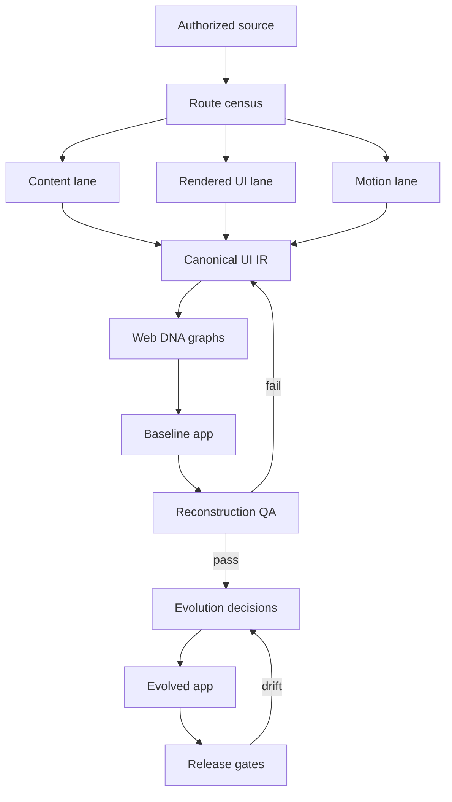

# TRIỀU ĐÔNG Y — WEB DNA & EVOLUTION MASTER PLAN

**Phiên bản:** 1.0 — Official Baseline  
**Ngày khóa:** 13/08/2026  
**Trạng thái:** APPROVED FOR EXECUTION  
**Chủ thể thực thi:** ChatGPT Work điều phối; Codex xây dựng, kiểm thử và đóng gói  
**Nguồn đích:** `https://trieudongy.vn/`

---

## 0. Executive decision

Dự án sẽ tạo một **Web DNA & Evolution Package**, không phải một bản tải HTML đơn giản.

Package phải đồng thời đạt ba mục tiêu:

1. **Bảo tồn:** thu thập có hệ thống toàn bộ route, nội dung, tài sản, cấu trúc UI, responsive behavior và motion của website nguồn.
2. **Tái dựng:** tạo baseline Next.js trung thực ở các page archetype trọng yếu; toàn bộ content được migrate bằng data pipeline.
3. **Tiến hóa:** từ baseline đã kiểm chứng, phát triển website mới kết hợp hai vai trò:
   - thư viện kiến thức Y học cổ truyền;
   - website thương hiệu và hành trình tiếp nhận nhu cầu trị liệu.

Nguyên tắc khóa:

> **Capture before inference. Baseline before redesign. Evidence before preference. Verify before release.**

---

## 1. Decision record

| ID | Quyết định | Trạng thái | Hệ quả triển khai |
|---|---|---|---|
| D-01 | Có quyền sao chép và tái sử dụng nội dung/tài sản của website nguồn | **LOCKED** | Cho phép tạo private forensic snapshot và production derivative; vẫn giữ provenance và audit trail |
| D-02 | Website mới kết hợp thư viện YHCT và thương hiệu trị liệu | **LOCKED** | IA phải hỗ trợ hai user journey nhưng dùng chung một design system và knowledge model |
| D-03 | Dựng baseline 1:1 cho các archetype trọng yếu trước, sau đó mới cải biến | **LOCKED** | Tách `baseline_app` và `evolved_app`; cấm trộn redesign vào vòng reconstruction |
| D-04 | ChatGPT Work là tác nhân điều phối kế hoạch | **LOCKED** | Work quản lý nguồn, artifact, gates, kiểm chứng và bàn giao cho Codex |
| D-05 | Codex là tác nhân xây dựng kỹ thuật | **LOCKED** | Codex nhận specs nhỏ, có source-of-truth, acceptance criteria và task dependency rõ |
| D-06 | Không nhập source của X-SLAYER/Website-Cloner | **LOCKED** | Chỉ tái hiện ý tưởng asset mirroring bằng module mới vì repo không có license được GitHub nhận diện |

### Biến chưa khóa

Các giá trị sau phải là configuration, không hard-code vào baseline:

- tên thương hiệu mới;
- pháp nhân và phạm vi dịch vụ được phép truyền thông;
- địa chỉ, hotline, email, Zalo;
- danh xưng chuyên môn;
- CTA cuối cùng;
- hệ màu/nhận diện của nhánh evolved.

---

## 2. Verified source lock

Các nguồn GitHub dưới đây được xác minh trực tiếp ngày 13/08/2026. Execution phải pin commit hoặc release; không dùng `latest` âm thầm.

| Nguồn | Pin đã xác minh | License | Tình trạng | Vai trò được duyệt |
|---|---|---|---|---|
| [D4Vinci/Scrapling](https://github.com/D4Vinci/Scrapling) | release `v0.4.14`; commit `5d213a2d4764002bfc4fed33c32fe09fa8b0bf7f` | BSD-3-Clause | Active, không archived | Crawl, dynamic fetch, adaptive parsing, structured extraction |
| [JCodesMore/ai-website-cloner-template](https://github.com/JCodesMore/ai-website-cloner-template) | release `v0.4.0`; commit `cc6f35b31a2e71c8611016a997455e912d50931f` | MIT | Active, không archived | Next.js scaffold, component specs, assembly, visual QA |
| [dembrandt/dembrandt](https://github.com/dembrandt/dembrandt) | release `v0.27.1`; commit `b149ef26d893404c7372dd40f4d6020d0e1d29cc` | MIT | Active, không archived | Design tokens, `DESIGN.md`, DTCG, WCAG, multi-page design extraction, drift |
| [dembrandt/dembrandt-skills](https://github.com/dembrandt/dembrandt-skills) | commit `f14d2e84ad7a8311b6c804c27ebf3f7db0029063` | MIT | Active, không archived | UI mindset: hierarchy, IA, motion, components, accessibility, UX pipeline |
| [X-SLAYER/Website-Cloner](https://github.com/X-SLAYER/Website-Cloner) | commit `7eccf624ddbc3d6a79915a4dd65a7a58d7b2eabf` | **Không xác định** | Code push gần nhất 2023; VB/regex desktop app | Concept-only: asset mirroring và path preservation |
| `motion-capture-v4.js` | SHA-256 `839d203d65acfa697309d9fb6d8c5a5796f5c4719d44018cbfc0d1fd9c489a58` | User-supplied | Local file, 2.633 dòng | Runtime motion forensics |

### Kết quả kiểm tra kỹ thuật motion engine

Đã chạy:

- `node --check`: **PASS**;
- CommonJS pure API load: **PASS**;
- 20 pure exports được nhận diện;
- matrix decomposition smoke test: **PASS**;
- stagger detection smoke test: **PASS**;
- spring inference smoke test: **PASS**;
- compact serializer JSON round-trip: **PASS**.

Điều chưa được claim:

- chưa chạy engine trực tiếp trên `trieudongy.vn`;
- chưa xác minh coverage thực tế của every route/state;
- chưa xác minh iframe/CSP/document-write behavior trên website nguồn;
- chưa đo độ chính xác easing/spring so với source config gốc.

---

## 3. Product definition

### 3.1 Hai journey, một nền tảng

Website evolved có hai entry journey:

#### Journey A — Tìm hiểu kiến thức

`Câu hỏi/triệu chứng → khám phá chủ đề → đọc nội dung → xem nguồn/liên quan → lưu/chia sẻ hoặc chuyển sang nhu cầu hỗ trợ`

#### Journey B — Tìm dịch vụ phù hợp

`Nhu cầu hiện tại → hiểu phạm vi hỗ trợ → xem phương pháp/quy trình → bằng chứng tin cậy → gửi nhu cầu/liên hệ`

Hai journey chia sẻ:

- một taxonomy YHCT;
- một hệ tìm kiếm;
- một author/trust model;
- một design system;
- một disclaimer/safety framework;
- một knowledge graph;
- một analytics event model.

### 3.2 Ranh giới sản phẩm

Baseline bảo tồn website nguồn. Evolved app không mặc định kế thừa mọi claim hoặc ngôn ngữ dịch vụ.

Vì đây là nội dung sức khỏe:

- claim y khoa phải có trạng thái review;
- tách rõ kiến thức tham khảo, truyền thống sử dụng, cơ chế đề xuất và bằng chứng lâm sàng;
- không biến công cụ tra cứu thành chẩn đoán cá nhân;
- CTA và thuật ngữ như “khám”, “điều trị”, “bác sĩ”, “lương y” phải dựa trên phạm vi pháp lý đã duyệt cho thương hiệu mới;
- các câu khẳng định tuyệt đối hoặc khuyên tự áp dụng phải được đưa vào content safety queue.

### 3.3 Page archetypes bắt buộc

1. Homepage.
2. Knowledge hub / Tàng thư.
3. Taxonomy landing.
4. Archive/listing có pagination.
5. Article detail.
6. Entity detail: huyệt, kinh mạch, vị thuốc, bài thuốc, học thuyết, hội chứng, danh y.
7. Search results.
8. Interactive lookup / tra cứu bộ huyệt.
9. Service index.
10. Service detail.
11. About / expert profile.
12. Contact / lead form.
13. Stories / short-form knowledge.
14. Legal, privacy, editorial policy và disclaimer.
15. 404, empty, loading và error states.

---

## 4. Definition of done

Dự án chỉ hoàn thành khi cả package và website đáp ứng các điều kiện sau.

### 4.1 Coverage

- 100% URL phát hiện được phân loại thành `captured`, `redirected`, `duplicate`, `excluded`, `blocked` hoặc `failed`.
- ≥98% URL public hợp lệ được lấy thành công sau retry policy.
- 100% page archetype có ít nhất một exemplar đầy đủ.
- 100% route P0/P1 có desktop và mobile screenshot baseline.
- 100% component tương tác P0 có state/trigger/transition contract.

### 4.2 Content và asset

- ≥98% asset reference được resolve hoặc có lý do rõ.
- Mỗi asset có source URL, local path, MIME, dimensions khi áp dụng và SHA-256.
- Duplicate asset được hợp nhất theo hash nhưng vẫn giữ usage edges.
- Content giữ nguyên source version trong raw layer; transformed content ở layer riêng.
- Internal link không bị mất khi migrate taxonomy.

### 4.3 Baseline fidelity

- Các route Tier A có perceptual visual difference mục tiêu ≤3% sau dynamic masking.
- Các route Tier B có perceptual visual difference mục tiêu ≤5%.
- Median bounding-box delta của thành phần chính ≤4px ở viewport chuẩn.
- Font family, weight, size, line-height và color của anchors chính được đối chiếu.
- Motion P0: duration sai lệch không quá `max(50ms, 10%)`; travel distance sai lệch ≤4px; đúng trigger family.

Các ngưỡng trên là acceptance target ban đầu. Capture phase phải tạo baseline noise test trước khi khóa threshold CI cuối cùng.

### 4.4 Quality của evolved app

- Build, lint và typecheck pass.
- Không có broken internal links P0/P1.
- Không có critical automated accessibility violations; manual review đạt mục tiêu [WCAG 2.2 AA](https://www.w3.org/TR/WCAG22/).
- `prefers-reduced-motion` được hỗ trợ cho toàn bộ motion không thiết yếu.
- Core Web Vitals production target ở percentile 75: LCP ≤2.5s, INP ≤200ms, CLS ≤0.1, theo [web.dev Web Vitals](https://web.dev/articles/vitals).
- Lighthouse CI chỉ là lab gate; INP production phải được kiểm bằng field/RUM vì INP không đo đầy đủ trong lab.

### 4.5 Codex handoff

- `AGENTS.md` đầy đủ và không mâu thuẫn.
- `MASTER_PROMPT.md` trỏ đúng source-of-truth.
- `task-graph.json` không có cycle.
- Mọi task có input, output, owner, dependency và acceptance check.
- Raw capture không bị nhồi toàn bộ vào một prompt; Codex truy xuất theo route/component ID.

---

## 5. System architecture



### 5.1 Capture engines

| Engine | Nhiệm vụ | Output chính |
|---|---|---|
| Scrapling | crawl sitemap/links, HTML, metadata, structured text, dynamic page fallback | raw HTML/Markdown, route log, content records |
| Browser/Playwright | rendered DOM, screenshots, computed CSS, states, accessibility tree, network log | visual/state evidence |
| Dembrandt | colors, typography, spacing, radii, shadows, breakpoints, components, WCAG, DTCG | design-system package |
| Motion Capture v4 | triggers, animation channels, easing, spring, stagger, scroll/pointer coupling | motion report, graph, recipes |
| Asset mirror adapter | resolve, download, hash, dedupe, rewrite path | asset manifest và local tree |
| Codex extraction scripts | normalize, validate schemas, join records, detect gaps | UI IR và audit reports |

### 5.2 Không dùng tool nào làm “nguồn chân lý duy nhất”

- HTML crawl không chứng minh rendered UI.
- Screenshot không chứng minh interaction model.
- Computed CSS không chứng minh original source token.
- Dembrandt không thay thế content crawl.
- Motion inference không phải source animation config.
- Search index không thay thế sitemap/DOM crawl.

Mọi kết luận quan trọng phải có provenance và confidence.

---

## 6. Canonical UI IR

UI IR là hợp đồng nối mọi tool và Codex.

### 6.1 Entity types

```text
site
route
page_archetype
section
component
slot
state
interaction
motion
token
asset
content_item
content_entity
claim
source_evidence
decision
test_case
```

### 6.2 Stable ID examples

```text
route:trieu:/huyet-dao/cach-du
archetype:entity-detail:huyet
section:home:hero
component:shared:site-header
state:site-header:scrolled
interaction:lookup:step-next
motion:site-header:shrink-on-scroll
asset:sha256:<hash>
content:huyet:cach-du
decision:evolved:dual-entry-hero
```

### 6.3 Evidence envelope

Mỗi value quan trọng phải hỗ trợ:

```json
{
  "value": "...",
  "source_url": "https://trieudongy.vn/...",
  "captured_at": "ISO-8601",
  "viewport": {"width": 1440, "height": 900, "dpr": 1},
  "state": "default|hover|focus|expanded|scrolled|...",
  "method": "dom|computed-style|screenshot|network|hook|inference",
  "confidence": "observed|strongly-inferred|proposed",
  "evidence_path": "..."
}
```

### 6.4 Conflict resolution

Khi hai engine mâu thuẫn:

1. Không ghi đè im lặng.
2. Lưu cả hai observation.
3. Ưu tiên runtime rendered evidence cho appearance.
4. Ưu tiên source/DOM semantics cho content và relation.
5. Gắn `conflict_id` và đưa vào verification queue.

---

## 7. Graph architecture

Phiên bản đầu dùng JSON/JSONL, không cần graph database. Graph database chỉ được thêm khi query volume chứng minh cần thiết.

| Graph | Nodes | Edges | Quyết định hỗ trợ |
|---|---|---|---|
| Site Graph | route, taxonomy, pagination | links-to, parent-of, redirects-to | coverage và IA |
| Composition Graph | page, section, component, slot | contains, reuses, overlays | component architecture |
| Interaction Graph | control, event, state, effect | triggers, transitions-to, reveals | behavior reconstruction |
| Motion Graph | motion, trigger, target, token, group | animates, couples, member-of | motion system |
| Content Graph | article, entity, topic, claim | belongs-to, references, related-to | knowledge explorer |
| Asset Graph | image, video, font, icon | used-by, variant-of, derived-from | asset dedupe và provenance |
| Decision Graph | evidence, finding, decision, test | supports, contradicts, verifies | UI evolution và audit |

### Graph validation

- không có orphan route trừ excluded/blocked;
- không có component ID không tồn tại;
- mọi motion target trỏ tới component/element evidence;
- mọi decision evolved có ít nhất một evidence edge hoặc được đánh dấu `strategic-proposal`;
- mọi release-critical decision có test edge.

---

## 8. Crawl and capture strategy

### 8.1 Route discovery union

Hợp nhất:

1. sitemap/index;
2. header, mega-menu, footer và breadcrumbs;
3. internal content links;
4. archive pagination;
5. WordPress REST endpoints nếu public và được phép;
6. runtime navigation bị motion harness chặn;
7. search-engine discovery chỉ để tìm gap, không phải nguồn content cuối.

Canonicalization:

- normalize scheme/host/trailing slash;
- bỏ tracking query;
- giữ query/fragment nếu tạo state thật;
- detect canonical link, redirect chain và duplicates;
- không crawl external domain như một phần source site.

### 8.2 Capture tiers

#### Tier 0 — Every URL

- status, redirect, canonical;
- raw HTML hoặc failure reason;
- title, meta, headings, links;
- content extraction;
- asset references;
- lightweight motion/style fingerprint;
- archetype classification.

#### Tier A — Critical journeys

Homepage, knowledge hub, search, lookup tool, service pages, contact/form và article/entity detail quan trọng:

- full screenshots ở 1440/768/390;
- complete interaction sweep;
- complete motion capture;
- accessibility tree;
- network/console log;
- section-level computed style specs.

#### Tier B — Archetype exemplars

Ít nhất 2–3 exemplar đa dạng cho mỗi archetype:

- screenshots desktop/mobile;
- responsive sweep;
- interaction and motion sampling;
- component/content schema verification.

#### Tier C — Repeated content pages

- full content/data migration;
- lightweight render sanity check;
- template-level QA thay vì pixel-diff mọi article giống nhau.

### 8.3 Viewports và states

Viewports chuẩn:

- desktop: `1440 × 900`;
- tablet: `768 × 1024`;
- mobile: `390 × 844`.

States cần dò:

- default;
- hover;
- keyboard focus;
- active/pressed;
- expanded/collapsed;
- scrolled/sticky;
- tab variants;
- carousel frames;
- loading/empty/error nếu tiếp cận được;
- reduced motion;
- form validation states.

### 8.4 Motion capture execution policy

1. Chạy `MotionCapture.crawl()` theo batch route nhỏ.
2. Lưu nguyên report trước trimming khi khả thi; bản compact dùng cho Codex.
3. Ghi `hookedEarly`, `loadMode`, blocked route và route budget.
4. Route iframe/CSP fail phải mở trực tiếp và chạy `MotionCapture.run()`.
5. Entrance quan trọng dùng `MotionCapture.arm()` và reload có kiểm soát.
6. Auto-control không được kích hoạt thao tác nguy hiểm; form submit, mua, xóa, gửi đều bị chặn.
7. Motion output phải join với component IDs; selector thô không phải khóa bền vững.
8. Reduced-motion capture chạy riêng để xác nhận fallback.

### 8.5 Retry và stop rules

- tối đa 3 attempts/URL theo ba mode: request → dynamic → browser direct;
- exponential backoff có giới hạn;
- không bypass access control;
- blocked/failure được ghi, không retry vô hạn;
- crawl có rate limit và concurrency phù hợp host;
- snapshot time được khóa để tránh trộn nhiều phiên bản website.

---

## 9. UI mindset system

`UI_MINDSET.md` là “hiến pháp UI”, không phải mô tả thẩm mỹ chung chung.

### 9.1 Required chapters

1. Brand thesis.
2. Dual-journey product thesis.
3. Attention hierarchy theo archetype.
4. Narrative sequence.
5. Information architecture và vocabulary.
6. Spatial grammar.
7. Typography grammar.
8. Color semantics.
9. Component grammar.
10. Interaction grammar.
11. Motion philosophy.
12. Responsive philosophy.
13. Trust, author và editorial safety.
14. Keep / Evolve / Remove.
15. Observed / Inferred / Proposed register.

### 9.2 Mindset cho sản phẩm kết hợp

Homepage evolved không được biến thành một trang “mọi thứ đều quan trọng”. Nó cần một promise chung và hai đường vào có thứ bậc rõ:

- **Khám phá kiến thức YHCT**;
- **Tìm hiểu hành trình hỗ trợ trị liệu**.

Một CTA là primary theo context; CTA còn lại là secondary. Brand color không đồng thời chiếm background, text và tất cả CTA.

### 9.3 Evolution hypotheses cần kiểm chứng

| ID | Giả thuyết | Chỉ số kiểm chứng | Điều kiện bác bỏ |
|---|---|---|---|
| H-01 | Dual-entry hero giúp người dùng định hướng nhanh hơn homepage tổng hợp hiện tại | time-to-first-valid-action, CTA completion | Không giảm thời gian hoặc tăng backtracking |
| H-02 | Knowledge explorer theo entity/taxonomy giúp tìm bài tốt hơn archive phẳng | search refinement, related-content CTR, successful navigation | Không tăng discovery hoặc làm người dùng rối hơn |
| H-03 | Trust layer chuẩn hóa làm tăng hành động liên hệ hợp lệ | qualified lead completion, trust-content engagement | Chỉ tăng click nhưng giảm chất lượng lead |
| H-04 | Motion system tĩnh tại, nhất quán tăng perceived quality mà không giảm usability | preference score, task time, reduced-motion parity | Task time xấu đi hoặc motion gây distraction |

Đây là hypothesis cho prototype/evaluation, không được mô tả là kết luận đã chứng minh.

---

## 10. Target technical architecture

### 10.1 Baseline stack

- Next.js 16 App Router;
- React 19;
- TypeScript strict;
- Tailwind CSS v4;
- route-scoped CSS variables;
- accessible primitives;
- CSS/Framer Motion cho motion thông thường;
- GSAP chỉ dùng cho scroll choreography thật sự cần thiết.

Stack này được kế thừa có chọn lọc từ AI Website Cloner Template, không bắt buộc giữ mọi dependency của template.

### 10.2 Content layer

Không hard-code hàng trăm bài viết trong React component.

Content pipeline:

```text
raw source
→ normalized content record
→ validated schema
→ MDX/JSON or CMS-ready export
→ static/dynamic route renderer
→ search index
```

Schema tối thiểu:

- canonical slug;
- title/subtitle;
- content type;
- taxonomy;
- author/reviewer;
- created/updated date;
- hero and inline media;
- body blocks;
- table of contents;
- related entities;
- claims/references;
- safety/disclaimer status;
- SEO metadata;
- source provenance.

### 10.3 Shared UI foundation

Foundation phải hoàn thành tuần tự trước page builders:

- fonts;
- design tokens;
- layout/container/grid;
- header/navigation;
- footer;
- breadcrumbs;
- button/link/form primitives;
- card families;
- article typography;
- motion tokens;
- content schemas;
- asset resolver;
- analytics events;
- accessibility utilities.

### 10.4 Namespacing

```text
src/app/
src/components/shared/
src/components/pages/
src/components/entities/
src/content/
public/assets/by-hash/
docs/web-dna/
tests/{unit,integration,visual,behavior,a11y}/
```

Không để builder theo trang sửa trực tiếp foundation nếu task contract không cấp quyền.

---

## 11. Work–Codex operating model

### ChatGPT Work chịu trách nhiệm

- điều phối phases và human gates;
- giữ decision register;
- thu và sắp xếp source evidence;
- duy trì manifest, audit và package identity;
- lập UI mindset và evolution hypotheses;
- phát hiện thiếu coverage;
- trình kết quả nghiệm thu.

### Codex chịu trách nhiệm

- viết crawler adapters và normalizers;
- xây UI IR schemas và validators;
- xây baseline/evolved app;
- viết tests, visual/behavior harness và reports;
- chạy build/lint/typecheck;
- review diff theo task scope;
- không tự thay đổi quyết định Locked.

### Human gates

| Gate | Khi nào | Người dùng duyệt gì |
|---|---|---|
| G0 | Đã hoàn thành | quyền reuse, dual product, baseline-first |
| G1 | Sau route census | scope URL, exclusions, page archetypes |
| G2 | Sau UI IR + mindset | IA, brand variables, Keep/Evolve/Remove |
| G3 | Sau baseline QA | mức fidelity và các sai lệch được chấp nhận |
| G4 | Trước evolved build | hướng UI mới và ưu tiên business |
| G5 | Trước release | legal copy, health content, brand, production QA |

---

## 12. Execution milestones

### M0 — Project bootstrap

**Output:** pinned source manifest, directory skeleton, schemas, decision register, execution config.  
**Exit:** mọi version pin resolve; no ambiguous output paths.

### M1 — Route census

**Output:** `routes.jsonl`, Site Graph, page archetype inventory, crawl plan.  
**Exit:** 100% discovered URL classified; G1 passed.

### M2 — Raw capture

**Output:** HTML/DOM/screenshots/network/motion/assets/content raw evidence.  
**Exit:** coverage targets đạt hoặc gaps được ghi rõ.

### M3 — UI IR & Web DNA

**Output:** canonical entities/edges/provenance, tokens, component specs, state machines, graphs.  
**Exit:** schema validation pass; no critical orphan edges.

### M4 — UI mindset & evolution brief

**Output:** `UI_MINDSET.md`, `KEEP_EVOLVE_REMOVE.md`, hypotheses, dual-journey IA.  
**Exit:** G2 passed.

### M5 — Faithful baseline

**Output:** baseline app, migrated content layer, shared component system.  
**Exit:** build pass và reconstruction QA đạt threshold; G3 passed.

### M6 — Evolved design system

**Output:** evolved tokens, page prototypes, updated components, content/trust layer.  
**Exit:** G4 passed trước full rollout.

### M7 — Full evolved app

**Output:** production candidate, all routes, analytics, forms, search, accessibility.  
**Exit:** acceptance suite pass.

### M8 — Release package

**Output:** source, Web DNA package, QA reports, migration/runbooks, release checklist.  
**Exit:** G5 passed; deployment là external action riêng.

---

## 13. Loop engineering

### 13.1 Capture loop

```text
discover → capture → normalize → gap detection → targeted recrawl → freeze snapshot
```

Stop khi URL coverage đạt hoặc mỗi gap có owner/reason.

### 13.2 Reconstruction loop

```text
spec → build → render → visual/structure/behavior diff → defect classify → patch → rerun
```

Defect taxonomy:

- content;
- asset;
- layout;
- typography;
- color/token;
- responsive;
- interaction;
- motion;
- accessibility;
- performance.

### 13.3 Evolution loop

```text
evidence → hypothesis → prototype → user/business evaluation → keep/revise/revert
```

Không dùng visual novelty làm bằng chứng UX.

### 13.4 Regression loop

```text
preview → tests → Dembrandt drift → visual diff → accessibility → performance → release decision
```

Design drift không mặc định là lỗi; drift chỉ pass khi có approved decision ID.

---

## 14. Verification plan

### 14.1 Source verification

- pin commit/release;
- lưu license snapshot;
- ghi access date;
- SHA-256 local scripts;
- không dùng search snippet làm bằng chứng implementation;
- repo không license bị loại khỏi code ingestion.

### 14.2 Artifact verification

| Artifact | Validation |
|---|---|
| JSON/JSONL | schema validation, unique IDs, referential integrity |
| URLs | status, canonical, redirect chain |
| Assets | checksum, MIME, dimensions, local availability |
| Screenshots | expected viewport, non-empty, stable masks |
| Motion reports | schema version, route linkage, targets, limitations |
| Content | required fields, link preservation, block counts |
| Design tokens | DTCG validation, semantic mapping, duplicates |
| Code | lint, typecheck, unit/integration/build |
| Routes | crawl-based link check và route snapshot |
| Accessibility | automated + keyboard/manual critical flow |
| Performance | lab CI + production field measurement plan |

### 14.3 Baseline verification matrix

Mỗi archetype phải được kiểm:

- desktop default;
- mobile default;
- header/navigation;
- primary CTA;
- at least one interactive state;
- article/entity typography nếu có;
- reduced-motion behavior nếu có animation;
- internal link continuity.

### 14.4 Verification register fields

```text
verification_id
claim_or_requirement
source_or_test
access_level
status: pass | fail | partial | blocked | not-run
evidence_path
checked_at
checker
limitations
next_action
```

### 14.5 Current verification register

| ID | Hạng mục | Trạng thái | Bằng chứng/giới hạn |
|---|---|---|---|
| V-001 | Quyền reuse | PASS | User-confirmed; scope public source site |
| V-002 | Scrapling source/license/version | PASS | GitHub repo API, license và release `v0.4.14` |
| V-003 | AI cloner source/license/version | PASS | GitHub repo API, MIT, release `v0.4.0` |
| V-004 | Dembrandt source/license/version | PASS | GitHub repo API, MIT, release `v0.27.1` |
| V-005 | Dembrandt skills license/commit | PASS | GitHub repo API, MIT, pinned commit |
| V-006 | X-SLAYER license suitability | FAIL FOR CODE INGESTION | GitHub license endpoint 404; concept-only |
| V-007 | Motion JS syntax | PASS | `node --check` |
| V-008 | Motion pure functions smoke test | PASS | matrix/stagger/spring/serializer tests |
| V-009 | Website homepage reachable | PASS | Public homepage opened 13/08/2026 |
| V-010 | Website contains multiple knowledge/service archetypes | PARTIAL | Homepage/navigation, blog, huyệt, lý luận, lookup, contact samples; full census not run |
| V-011 | Full route coverage | NOT RUN | M1 task |
| V-012 | Dembrandt extraction on target | NOT RUN | M2 task |
| V-013 | Motion capture on target | NOT RUN | M2 task |
| V-014 | Baseline build/fidelity | NOT RUN | M5 task |
| V-015 | Evolved app WCAG/performance | NOT RUN | M7 task |

---

## 15. Package contract

```text
trieu-web-dna/
├── 00_MANIFEST.md
├── 01_governance/
│   ├── DECISIONS.md
│   ├── SCOPE_AND_PERMISSION.md
│   ├── SOURCE_LOCK.json
│   ├── source_audit.jsonl
│   └── verification_register.jsonl
├── 02_raw_capture/
│   ├── html/
│   ├── dom/
│   ├── screenshots/{desktop,tablet,mobile}/
│   ├── motion/
│   ├── network/
│   └── console/
├── 03_inventory/
│   ├── routes.jsonl
│   ├── page_archetypes.json
│   ├── content_inventory.jsonl
│   └── asset_manifest.jsonl
├── 04_ui_ir/
│   ├── entities.jsonl
│   ├── edges.jsonl
│   ├── provenance.jsonl
│   └── schemas/
├── 05_design_system/
│   ├── DESIGN.md
│   ├── tokens.dtcg.json
│   ├── tokens.css
│   ├── typography.md
│   ├── responsive.md
│   └── accessibility.md
├── 06_ui_specs/
│   ├── PAGE_TOPOLOGY.md
│   ├── BEHAVIORS.md
│   ├── pages/
│   └── components/
├── 07_motion_system/
│   ├── motion-graph.json
│   ├── motion-tokens.json
│   ├── state-machines/
│   └── recipes/{css,framer,gsap}/
├── 08_ui_mindset/
│   ├── UI_MINDSET.md
│   ├── KEEP_EVOLVE_REMOVE.md
│   ├── UX_FINDINGS.md
│   └── REDESIGN_HYPOTHESES.md
├── 09_codex_handoff/
│   ├── AGENTS.md
│   ├── MASTER_PROMPT.md
│   ├── task-graph.json
│   ├── acceptance-criteria.yaml
│   └── runbooks/
├── 10_baseline_app/
├── 11_evolved_app/
└── 12_qa/
    ├── visual-diff/
    ├── behavior-diff/
    ├── route-coverage.json
    ├── accessibility-report.json
    ├── performance-report.json
    └── build-report.md
```

### Manifest rule

`00_MANIFEST.md` phải cho Codex biết:

- bắt đầu đọc từ đâu;
- artifact nào là raw, normalized, inferred và approved;
- page/component ID nào liên quan task hiện tại;
- file nào không được sửa;
- test nào phải chạy trước khi hoàn tất.

---

## 16. Risk register

| ID | Rủi ro | Mức | Control |
|---|---|---|---|
| R-01 | Crawl được nhưng không đồng nghĩa content claim đúng | Critical | content provenance + medical/editorial review |
| R-02 | Nhánh evolved dùng ngôn ngữ vượt phạm vi pháp lý thương hiệu mới | Critical | legal copy gate G5; configurable terms |
| R-03 | UI trông giống nhưng interaction model sai | High | interaction graph + behavior QA |
| R-04 | Motion inference bị coi là source config | High | confidence labels; preserve limitations |
| R-05 | Site thay đổi giữa các lần crawl | High | timestamped frozen snapshot |
| R-06 | Tool outputs mâu thuẫn | High | UI IR conflict log và provenance |
| R-07 | Crawl mọi trang với full browser/motion quá tốn | Medium | tiered capture; full content + archetype-deep UI |
| R-08 | Parallel builders đè shared files | High | sequential foundation, ownership map, task DAG |
| R-09 | Context package quá lớn | High | compact specs, retrieval by stable ID |
| R-10 | X-SLAYER source gây license risk | High | no code ingestion |
| R-11 | Dynamic carousel làm visual diff nhiễu | Medium | freeze time/state, masks, deterministic fixtures |
| R-12 | Automated a11y tạo cảm giác pass giả | High | keyboard/manual critical-flow review |

---

## 17. Rollback and preservation

- Raw capture immutable sau snapshot freeze.
- Normalized records versioned; không sửa raw để “làm sạch”.
- Baseline app và evolved app ở namespace/branch riêng.
- Mỗi approved design drift có decision ID.
- Content transform giữ link tới source record.
- Release candidate có reproducible lockfile và source pins.
- Không deploy, publish hoặc thay domain nếu chưa qua G5 và external-action approval.

---

## 18. First execution queue

Sau khi master plan này được duyệt, thứ tự chạy chính thức:

1. Khởi tạo package skeleton và `SOURCE_LOCK.json`.
2. Xây route census crawler.
3. Chạy sitemap/navigation/content-link discovery.
4. Phân loại page archetypes và trình Gate G1.
5. Xây capture harness kết hợp Scrapling, browser, Dembrandt và motion engine.
6. Chạy pilot trên homepage + một archive + một article + lookup tool + service/contact.
7. Verify pilot outputs, sửa schemas/harness.
8. Chạy full content crawl và tiered UI/motion capture.
9. Xây UI IR, graphs và UI mindset.
10. Trình Gate G2 trước khi Codex dựng baseline.

Pilot là bắt buộc: nó kiểm chứng pipeline trước khi chi phí crawl toàn site phát sinh.

---

## 19. Review conclusion

### Kết luận đã xác minh

- Systematic combination của các nguồn là khả thi nếu ghép qua UI IR, không merge codebase trực tiếp.
- Scrapling, Dembrandt và AI Website Cloner Template có license phù hợp để sử dụng theo điều kiện license tương ứng.
- X-SLAYER chỉ phù hợp làm nguồn ý tưởng.
- Motion Capture v4 hợp lệ về cú pháp và pure-function smoke tests; đủ tư cách vào pilot với nhãn “runtime inference engine”.
- Website nguồn thể hiện đồng thời content knowledge, service/contact và interactive lookup; vì vậy quyết định dual product có cơ sở từ cấu trúc hiện có.

### Điều chưa thể xác minh trước execution

- tổng số route và asset;
- coverage của sitemap;
- motion thật ở mọi route;
- độ fidelity cuối;
- hiệu quả UX của hướng evolved;
- WCAG/performance của app chưa được xây.

Những mục này đã được chuyển thành milestone, test và gate cụ thể thay vì được giả định là hoàn thành.

---

## 20. Primary sources

- [Triều Đông Y](https://trieudongy.vn/)
- [Scrapling repository](https://github.com/D4Vinci/Scrapling)
- [Scrapling v0.4.14](https://github.com/D4Vinci/Scrapling/releases/tag/v0.4.14)
- [AI Website Cloner Template](https://github.com/JCodesMore/ai-website-cloner-template)
- [AI Website Cloner Template v0.4.0](https://github.com/JCodesMore/ai-website-cloner-template/releases/tag/v0.4.0)
- [Dembrandt repository](https://github.com/dembrandt/dembrandt)
- [Dembrandt v0.27.1](https://github.com/dembrandt/dembrandt/releases/tag/v0.27.1)
- [Dembrandt Skills](https://github.com/dembrandt/dembrandt-skills)
- [X-SLAYER Website-Cloner](https://github.com/X-SLAYER/Website-Cloner)
- [WCAG 2.2](https://www.w3.org/TR/WCAG22/)
- [Web Vitals](https://web.dev/articles/vitals)
- User-supplied `motion-capture-v4.js`, SHA-256 recorded above.

---

**Approval state:** Master Plan v1.0 is ready to become the execution source-of-truth.  
**Next gate:** G1 — Route census and page archetype approval.
